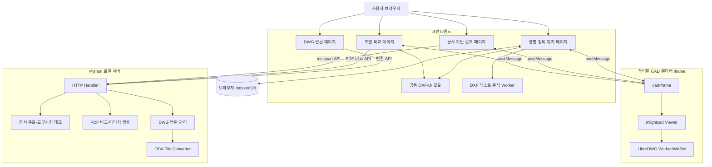

# 도면자동화 v0.9.6 기술문서

## 1. 문서 개요

이 문서는 `도면자동화 v0.9.6`의 현재 구현을 기준으로 작성한 상세 기술문서다.
프로젝트를 처음 인수하는 개발자가 전체 구조를 파악하고, 각 기능의 데이터 흐름과
알고리즘을 이해하며, 장애를 분석하거나 기능을 확장할 수 있도록 하는 것을 목적으로 한다.

본 문서에서 다루는 범위는 다음과 같다.

- 제품의 기능 범위와 현재 지원 수준
- 프런트엔드, CAD 렌더러, Python 서버의 전체 아키텍처
- DWG/DXF 렌더링 및 두 도면 비교 처리 과정
- DXF 코드페이지 감지와 한글 보정 방식
- PDF 비교와 문서 기반 설계 검토 방식
- DWG → DXF 단일 및 일괄 변환 방식
- 층별 도면 등록, 장비 분류, 판넬명 연결 및 IndexedDB 저장 방식
- 브라우저와 iframe 사이의 메시지 계약
- HTTP API 계약과 오류 처리 방식
- 대용량 파일 처리와 성능·안정성 설계
- 테스트, 빌드, 배포, 운영 및 문제 해결 방법
- 현재 한계와 향후 고도화 방향

> 이 프로젝트는 현재 로컬 PC에서 실행하는 웹 애플리케이션이다. 서버는 기본적으로
> `127.0.0.1`에만 바인딩되며 GitHub Pages 같은 정적 호스팅 배포는 적용하지 않았다.

---

## 2. 제품 개요

### 2.1 목적

건축·기계·전기 CAD 도면을 브라우저에서 빠르게 열고 다음 업무를 자동화하거나 보조한다.

1. 두 도면의 추가·삭제·변경 객체를 찾아 검토 목록으로 제공한다.
2. 검토 항목을 클릭하면 실제 도면상의 위치로 이동한다.
3. 시방서, 자재승인서 등의 문서 요구사항을 도면 표기와 대조한다.
4. DWG를 DXF로 단일 또는 일괄 변환한다.
5. 층별 도면을 등록하고 주요 장비와 판넬 위치를 검색한다.

### 2.2 현재 버전

- 제품 표시 버전: `v0.9.6`
- npm 패키지명: `drawing-automation-v0.9.6`
- npm 패키지 버전: `0.9.6`
- 층별 장비 분석 규칙 버전: `25`
- IndexedDB 스키마 버전: `1`

제품 버전과 장비 분석 규칙 버전은 서로 다른 목적을 가진다. 제품 버전은 전체 애플리케이션의
릴리스 단계를 나타내며, 장비 분석 규칙 버전은 저장된 도면을 새 규칙으로 다시 분석할지 결정한다.

### 2.3 주요 페이지

| 공개 URL | 실제 HTML | 역할 |
|---|---|---|
| `/index.html` | `index.html` | DWG/DXF 렌더링 및 두 도면 비교 |
| `/review.html` | `pages/review.html` | 문서 기반 도면 검토 |
| `/convert.html` | `pages/convert.html` | DWG → DXF 변환 |
| `/render-test.html` | `pages/render-test.html` | 층별 도면 및 장비 위치 관리 |
| `/cad-frame.html` | `pages/cad-frame.html` | 격리된 CAD 렌더러 iframe |

Python 서버의 `PAGE_ALIASES`가 기존 공개 URL을 `pages/` 아래 실제 파일에 연결한다.
따라서 파일 구조를 정리한 뒤에도 사용자가 기존 주소를 계속 사용할 수 있다.

---

## 3. 기술 스택

### 3.1 프런트엔드

- 표준 HTML5, CSS, JavaScript ES Modules
- Vite `8.2.2`
- Node.js `20.19.0` 이상
- 브라우저 IndexedDB
- Web Worker
- iframe 및 `window.postMessage`

별도의 React, Vue 같은 UI 프레임워크를 사용하지 않는다. 화면별 진입 모듈이 DOM을 직접
제어하며, 계산 로직은 가능한 한 DOM과 분리된 순수 모듈로 구성한다.

### 3.2 CAD 렌더링

- `@mlightcad/cad-simple-viewer` `1.6.3`
- `@mlightcad/data-model` `1.14.3`
- `@mlightcad/libredwg-converter` `3.14.3`
- LibreDWG WebAssembly
- `Noto Sans CJK KR` CAD 한글 글꼴

DWG/DXF의 고성능 시각화는 mlightcad 뷰어가 담당한다. DWG 파싱은 별도 Worker와
LibreDWG WebAssembly에서 실행된다. DXF 변경점 계산은 자체 경량 파서를 사용한다.

### 3.3 백엔드

- Python 3
- `ThreadingHTTPServer`
- `SimpleHTTPRequestHandler` 기반 사용자 정의 Handler
- PyMuPDF `1.28.0`
- Python 표준 라이브러리의 multipart, ZIP, XML, subprocess, tempfile 기능

서버는 프레임워크 없이 구성된 로컬 전용 경량 서버다. 정적 파일 제공과 API 처리를 하나의
프로세스가 담당한다.

### 3.4 외부 변환 도구

- ODA File Converter

ODA는 DWG → DXF 변환 API에서만 사용된다. 브라우저의 DWG 렌더링 자체는 ODA와 무관하다.

### 3.5 라이선스 유의사항

LibreDWG 관련 구성 요소는 GPL-3.0 라이선스를 사용한다. 관련 고지는 다음 파일에 있다.

- `THIRD_PARTY_NOTICES.md`
- `public/cad-assets/LICENSE-GPL-3.0.txt`

상용 배포나 외부 배포 전에 전체 의존성 라이선스와 배포 형태를 별도로 검토해야 한다.

---

## 4. 전체 아키텍처

### 4.1 논리 구성



### 4.2 핵심 설계 원칙

#### 계산과 UI 분리

`src/features/compare/engine.js`는 DOM, iframe, 네트워크 또는 화면 전역 상태를 참조하지 않는다.
파싱·기하·정렬·비교를 순수 데이터 입력과 출력으로 수행해 테스트 가능성을 확보한다.

#### 고성능 렌더링과 비교 계산 분리

화면 표현은 mlightcad가 담당하고, 변경 목록은 자체 DXF 파서가 담당한다. 이를 통해 복잡한
대형 도면 렌더링 성능을 확보하면서도 변경 항목의 종류와 좌표를 애플리케이션이 직접 제어한다.

#### iframe을 이용한 렌더러 격리

각 도면은 독립 iframe에서 열린다. WebGL 상태와 대형 모델 메모리가 프레임별로 분리되므로
두 도면을 동시에 열 때 렌더러 간 상태 충돌을 줄일 수 있다.

#### 대용량 분석의 Worker 처리

층별 장비 분석은 수십~수백 MB의 DXF를 대상으로 한다. 텍스트와 블록 좌표 전개는 전용
Web Worker에서 수행해 메인 UI 스레드 정지를 줄인다.

#### 로컬 우선 처리

도면 렌더링, DXF 비교, 장비 분석은 브라우저에서 수행한다. 서버 전송이 필요한 기능은 PDF
처리, 문서 검토 및 ODA 변환이다.

---

## 5. 디렉터리 및 모듈 구조

```text
newproject/
├─ app.js                         # 도면 비교 페이지 진입점
├─ index.html                     # 도면 비교 HTML
├─ styles.css                     # 공통/비교 기본 스타일
├─ features.css                   # 기능 페이지 공통 스타일
├─ pages/
│  ├─ review.html                 # 문서 기반 검토
│  ├─ convert.html                # DWG 변환
│  ├─ render-test.html            # 층별 장비 위치
│  └─ cad-frame.html              # CAD iframe
├─ src/
│  ├─ cad/
│  │  └─ frame.js                 # mlightcad 초기화와 카메라 제어
│  ├─ features/
│  │  ├─ compare/
│  │  │  ├─ page.js               # 비교 페이지 상태와 이벤트
│  │  │  ├─ engine.js             # DXF 파싱·정렬·비교
│  │  │  └─ svg-renderer.js       # 비교용 경량 SVG 생성
│  │  ├─ review/page.js           # 문서 검토 UI
│  │  ├─ convert/page.js          # 변환 UI
│  │  └─ equipment/
│  │     ├─ page.js               # 층별 도면과 장비 UI
│  │     ├─ analysis.js           # 장비 분류·판넬 연결
│  │     ├─ corrections.js        # 사용자 교정·검수·일괄 변경
│  │     ├─ dictionary.js         # 사용자 장비 사전과 JSON 입출력
│  │     ├─ drawing-order.js      # 등록 도면 순서 정규화
│  │     ├─ report.js             # 수량 집계와 Excel 왕복 처리
│  │     └─ store.js              # IndexedDB 접근
│  ├─ shared/
│  │  ├─ cad-renderer.js          # 부모 페이지의 iframe 관리
│  │  ├─ dxf-encoding.js          # DXF 코드페이지 감지·보정
│  │  ├─ dxf-text.js              # CAD 제어문자 정리
│  │  └─ ui-utils.js              # HTML escape, 크기 표현 등
│  └─ workers/
│     └─ review-dxf-worker.js     # 텍스트·블록 좌표 분석 Worker
├─ public/
│  ├─ equipment-priority.json     # 장비 우선순위와 별칭 사전
│  ├─ cad-assets/                 # LibreDWG Worker/WASM
│  └─ cad-data/fonts/             # CAD 글꼴
├─ server.py                      # Python 서버 진입점
├─ server_modules/
│  ├─ config.py                   # 경로·업로드 제한 설정
│  ├─ handler.py                  # 정적 파일 및 API 라우팅
│  ├─ multipart.py                # multipart 파싱
│  ├─ documents.py                # PDF/DOCX/TXT/DXF 추출
│  ├─ review.py                   # 요구사항 대조
│  ├─ pdf_images.py               # PDF 이미지·변경 타일
│  ├─ pdf_compare.py              # PDF 비교
│  └─ converter.py                # ODA 탐지와 변환
├─ tests/
│  ├─ frontend/                   # Node 기반 회귀 테스트
│  └─ server/                     # Python unittest
├─ vite.config.js                 # 다중 HTML 진입점
├─ package.json
├─ requirements.txt
└─ run-app.bat                    # Windows 실행 자동화
```

---

## 6. 빌드 및 실행 구조

### 6.1 npm 스크립트

| 명령 | 동작 |
|---|---|
| `npm start` | Vite 빌드 후 Python 서버 실행 |
| `npm run build` | `dist/` 프로덕션 빌드 생성 |
| `npm run dev` | Vite 개발 서버를 `127.0.0.1`에 실행 |
| `npm run preview` | Vite 빌드 미리보기 서버 실행 |
| `npm test` | 프런트엔드 테스트 후 서버 테스트 실행 |
| `npm run test:frontend` | Node 테스트 실행 |
| `npm run test:server` | Python unittest 실행 |

### 6.2 Vite 다중 진입점

`vite.config.js`는 다섯 HTML 파일을 각각 진입점으로 빌드한다.

- `compare`: `index.html`
- `review`: `pages/review.html`
- `convert`: `pages/convert.html`
- `renderTest`: `pages/render-test.html`
- `cadFrame`: `pages/cad-frame.html`

### 6.3 정적 파일 선택

`server_modules/config.py`는 `dist/index.html`이 존재하면 `dist/`를 정적 루트로 사용한다.
빌드 결과가 없으면 프로젝트 루트를 사용한다. 일반 실행은 `npm start`가 먼저 빌드하므로
대부분 `dist/`가 제공된다.

### 6.4 서버 바인딩

서버는 기본적으로 다음 주소에만 열린다.

```text
http://127.0.0.1:8000
```

`python server.py 9000`처럼 첫 번째 명령행 인자로 포트를 변경할 수 있다. 호스트는 코드상
`127.0.0.1`로 고정되어 있어 같은 네트워크의 다른 PC에는 직접 노출되지 않는다.

---

## 7. CAD 렌더링 시스템

### 7.1 부모 페이지와 iframe

부모 페이지의 `src/shared/cad-renderer.js`가 렌더러 iframe을 생성하고 관리한다.
실제 mlightcad 초기화는 `src/cad/frame.js`에서 수행한다.

분리 목적은 다음과 같다.

- 원본과 변경본의 WebGL 상태 분리
- 대형 모델 메모리 분리
- 렌더러 내부 이벤트와 업무 UI 이벤트 분리
- 렌더러 교체 시 부모 페이지 영향 최소화

### 7.2 파일 전달

1. 사용자가 파일을 선택한다.
2. 부모가 `File.arrayBuffer()`로 데이터를 읽는다.
3. `cad-renderer-load` 메시지에 ArrayBuffer를 담는다.
4. transfer list를 사용해 iframe으로 소유권을 이동한다.
5. iframe은 `openDocument()`로 도면을 연다.

transfer list를 사용하므로 대용량 ArrayBuffer를 구조화 복제하는 비용을 줄일 수 있다.

### 7.3 경쟁 상태 방지

파일을 연속 선택하면 먼저 선택한 대용량 파일의 읽기가 나중에 끝날 수 있다.
부모는 side별 `generation` 번호를 증가시키고, 완료 시 현재 generation과 일치하는 데이터만
전송한다. 층별 장비 페이지도 같은 목적의 `renderGeneration`을 사용한다.

### 7.4 mlightcad 초기화

iframe은 다음 순서로 초기화한다.

1. DWG 변환 관리자로 `AcDbLibreDwgConverter` 등록
2. DWG Parser Worker URL 설정
3. `AcApDocManager` 생성
4. CAD 데이터와 Worker 기본 URL 지정
5. `Noto Sans CJK KR` 글꼴 로드
6. 부모에 `cad-renderer-ready` 전송

DWG 파일을 열기 전에는 `areWorkersReady()`로 Worker/WASM 접근 가능 여부를 확인한다.

### 7.5 렌더링 옵션

```text
minimumChunkSize: 1000
readOnly: true
convertByEntityType: false
useWorker: true
```

도면은 읽기 전용으로 열며, 파싱은 Worker를 사용한다. 문서를 열면 `zoom all` 명령으로 전체
도면을 맞춘다.

### 7.6 위치 이동

검토 항목이나 장비를 클릭하면 `cad-renderer-focus` 메시지를 전송한다. iframe은 현재 확대율을
유지한 채 중심점만 변경한다. 따라서 항목을 반복 클릭할 때마다 과도하게 확대되는 현상을
방지한다. 이동 위치에는 약 1.6초 동안 임시 마커가 표시된다.

### 7.7 가운데 버튼 브라우저 자동 스크롤 차단

CAD pan은 휠 버튼을 누른 채 드래그하는 방식이다. Chrome의 가운데 버튼 자동 스크롤과
충돌하지 않도록 iframe 문서의 `mousedown`과 `auxclick`을 capture 단계에서 차단한다.

### 7.8 iframe 메시지 계약

#### 부모 → iframe

| type | 주요 필드 | 설명 |
|---|---|---|
| `cad-renderer-load` | `side`, `name`, `buffer` | 도면 파일 열기 |
| `cad-renderer-fit` | `side` | 전체 도면 맞춤 |
| `cad-renderer-focus` | `side`, `center` | 현재 확대율로 중심 이동 |
| `cad-renderer-apply-view` | `center`, `zoom` | 다른 iframe 카메라 적용 |

#### iframe → 부모

| type | 주요 필드 | 설명 |
|---|---|---|
| `cad-renderer-ready` | 없음 | 렌더러 초기화 완료 |
| `cad-renderer-loaded` | `side`, `name` | 도면 열기 완료 |
| `cad-renderer-error` | `side`, `detail` | 렌더링 오류 |
| `cad-renderer-view-changed` | `side`, `center`, `zoom` | 카메라 변경 알림 |

모든 메시지는 `event.origin === window.location.origin`을 확인한다.

### 7.9 좌우 카메라 동기화

원본 iframe에서 카메라가 변경되면 부모가 변경본 iframe에 중심과 확대율을 전달한다.
반대 방향도 동일하다. 원격 카메라를 적용하는 동안 `suppressViewBroadcast`를 켜서 두 iframe이
서로 같은 이벤트를 무한 반복하지 않도록 한다.

도면 자동 정렬이 적용된 경우 부모는 좌표와 확대율을 정렬 변환의 정방향 또는 역방향으로
변환한다. 렌더러 내부 모델 좌표는 변경하지 않고 메시지 경계에서만 변환한다.

---

## 8. DXF 인코딩과 한글 처리

### 8.1 문제 배경

국내 DXF에는 다음과 같은 파일이 혼재한다.

- 실제 CP949이며 헤더도 `ANSI_949`인 파일
- 실제 UTF-8이지만 헤더가 `ANSI_949`인 파일
- 실제 UTF-8이지만 헤더가 `ANSI_1252`인 파일
- `$DWGCODEPAGE`가 누락된 파일
- `\U+AC00` 같은 유니코드 이스케이프를 포함한 파일

헤더만 믿으면 정상 UTF-8 한글을 CP949로 다시 해석해 모지바케가 발생할 수 있다.

### 8.2 감지 순서

`src/shared/dxf-encoding.js`의 주요 판단 순서는 다음과 같다.

1. UTF-8 BOM 확인
2. 전체 바이트를 strict UTF-8로 검증
3. 앞쪽 최대 262,144바이트에서 `$DWGCODEPAGE` 확인
4. UTF-8 바이트가 완전히 유효하고 비ASCII 문자가 있으면 실제 바이트를 우선
5. 알려진 코드페이지를 `TextDecoder` 라벨로 변환
6. `ANSI_nnn`이면 `windows-nnn` 후보 사용
7. 미확정 파일은 UTF-8 유효성에 따라 UTF-8 또는 EUC-KR 추정

잘못 선언되는 빈도가 높은 헤더는 다음과 같다.

```text
ANSI_1252, ANSI_949, DOS949, KSC5601
```

### 8.3 디코딩 품질 평가

UTF-8이 아닌 후보 디코딩이 필요할 때 다음 요소로 품질을 평가한다.

- 한글 음절 수: 가점
- 대체문자 `U+FFFD`: 큰 감점
- UTF-8 모지바케 흔적: 감점
- 비정상 제어문자: 감점

CP949 후보가 기존 결과보다 충분히 좋고 실제 한글을 포함할 때만 CP949 보정을 적용한다.

### 8.4 CAD 제어문자 정리

`cleanCadText()`는 목록 및 비교에 사용하기 전에 다음을 정리한다.

- MTEXT 분수 표기 `\S...;`
- 줄바꿈 `\P`
- non-breaking space `\~`
- 글꼴·정렬·높이 등 MTEXT 제어 코드
- `%%U` 등의 구형 AutoCAD 제어 코드
- 중괄호
- 대체문자와 반복 물음표
- 중복 공백

렌더러는 원래 CAD 표현을 사용하지만, 검색·비교·목록은 정리된 문자열을 사용한다.

---

## 9. DXF 파싱 및 블록 전개

### 9.1 파싱 단위

ASCII DXF는 group code와 value가 두 줄 한 쌍으로 반복된다. 비교 엔진은 전체 문자열을 pair
배열로 변환한 후 `ENTITIES`와 `BLOCKS` 섹션을 처리한다.

### 9.2 비교 엔진 지원 엔티티

- `LINE`
- `CIRCLE`
- `ARC`
- `LWPOLYLINE`
- `POLYLINE`
- `TEXT`
- `MTEXT`
- `INSERT`
- `POINT`
- `DIMENSION`

엔티티는 공통적으로 type, layer, points를 갖고 필요한 경우 radius, text, height, rotation,
scale, block, bulge, closed 등의 속성을 갖는다.

### 9.3 블록 정의

`BLOCKS` 섹션을 먼저 읽고 다음 정보를 Map에 저장한다.

- 블록명
- 기준점
- 블록 내부 엔티티

블록 내부 엔티티도 일반 파싱 경로를 재사용한다. 그 결과 일반 엔티티와 블록 엔티티가 같은
데이터 구조를 사용한다.

### 9.4 INSERT 좌표 변환

블록 엔티티의 월드 좌표는 다음 순서로 계산한다.

1. 블록 기준점 제거
2. X/Y 축척 적용
3. 회전 적용
4. INSERT 삽입점 이동

레이어가 `0`인 블록 내부 엔티티는 INSERT의 레이어를 상속한다. 반지름과 문자 높이는 평균
축척을 적용하며, 회전각과 호의 시작·끝 각도에도 INSERT 회전을 더한다.

### 9.5 호출 스택 초과 방지

과거 대형 취합 도면에서 재귀 블록 전개 중 `Maximum call stack size exceeded`가 발생할 수
있었다. 현재 비교 엔진은 명시적 배열 스택을 사용하는 반복 알고리즘으로 전개한다.

보호 기준은 다음과 같다.

- 최대 중첩 깊이: `32`
- 최대 전개 객체 수: `1,000,000`
- ancestry Set으로 순환 블록 차단

파싱 결과에는 다음 진단 정보가 포함된다.

- `truncated`
- `omittedEntities`
- `circularReferences`
- `entityLimit`
- `blockCount`

서버의 경량 DXF 미리보기 역시 반복 스택과 최대 1,000,000 객체 제한을 사용한다.

---

## 10. 도면 정렬 알고리즘

### 10.1 정렬이 필요한 이유

내용이 같은 도면도 전체 원점 이동, 회전 또는 축척 변경이 있으면 모든 객체가 변경으로
판단될 수 있다. 비교 전에 공통 앵커를 이용해 변경본 좌표를 원본에 맞춘다.

### 10.2 앵커

정렬 앵커로 사용하는 객체는 다음과 같다.

- 고유한 TEXT/MTEXT 문자열과 레이어 조합
- 고유한 INSERT 블록명과 레이어 조합

동일 키가 한 도면 안에서 여러 번 나타나면 위치가 모호하므로 유사도 변환 앵커에서 제외한다.

### 10.3 유사도 변환

공통 고유 앵커가 두 개 이상 있으면 다음을 추정한다.

- 균일 축척
- 회전각
- X/Y 평행 이동

앵커가 너무 많으면 최대 160개로 표본화한다. 앵커 쌍으로 후보 변환을 만들고 다른 앵커의
잔차를 평가해 득표수가 높고 오류가 낮은 후보를 선택한다.

주요 조건은 다음과 같다.

- 너무 가까운 앵커 쌍 제외
- 허용 축척 범위: `0.1`~`10`
- 잔차 허용 기준: 도면 span의 약 `0.8%`
- 최소 신뢰도: 약 `55%`

### 10.4 평행 이동 폴백

유사도 변환을 신뢰할 수 없으면 좌표를 제외한 형상 서명이 같은 객체들의 중심 차이를
격자화한다. 가장 많은 표를 받은 X/Y 이동량을 사용한다.

앵커가 부족하거나 신뢰도가 낮으면 정렬을 적용하지 않는다. 잘못된 자동 정렬보다 무정렬을
선택하는 보수적 정책이다.

---

## 11. DXF 변경 비교 알고리즘

### 11.1 결과 종류

비교 결과는 세 종류로 통일한다.

- `added`: 변경본에만 존재
- `removed`: 원본에만 존재
- `changed`: 같은 유형의 근접 객체지만 속성 또는 형상이 다름

UI, 필터 및 CSV 내보내기는 같은 결과 배열을 소비한다.

### 11.2 정확히 동일한 객체 제거

먼저 엔티티 전체 서명을 계산한다. 서명에는 다음이 포함된다.

- 타입과 레이어
- 소수점 둘째 자리로 정규화한 좌표
- 반지름과 각도
- 문자
- 블록명
- 높이와 회전
- 닫힘 여부와 bulge

변경본 엔티티를 서명별 bucket에 넣고 원본과 정확히 같은 객체를 빠르게 제거한다.

### 11.3 공간 인덱스

정확히 같지 않은 객체는 도면 span을 기준으로 공간 격자에 넣는다. 원본 객체 중심 주변의
격자 셀을 반경 1~4까지 탐색해 같은 타입 후보를 찾는다.

후보 점수는 다음 요소를 조합한다.

- 중심점 거리 / 도면 span
- 레이어 불일치 가중치
- 문자 불일치 가중치

점수가 임계값보다 작으면 `changed`, 그렇지 않으면 `removed`로 처리한다. 끝까지 사용되지 않은
변경본 객체는 `added`가 된다.

### 11.4 변경 상세 문구

변경 상세는 우선순위에 따라 다음과 같이 생성된다.

- 문자 변경
- 레이어 변경
- 위치 이동과 이동 거리
- 반지름 변경
- 기타 형상 또는 속성 변경

### 11.5 목록 클릭

각 결과는 원본 또는 변경본 엔티티 인덱스와 중심 좌표를 포함한다. 사용자가 항목을 클릭하면
두 렌더러에 각각 관련 중심 좌표를 전달한다. 카메라 배율은 유지하고 위치만 이동한다.

---

## 12. PDF 비교

### 12.1 처리 위치

PDF 비교는 브라우저가 아니라 Python 서버의 `/api/pdf/compare`에서 수행한다.

### 12.2 처리 과정

1. 두 PDF를 PyMuPDF로 연다.
2. 최대 페이지 수를 기준으로 페이지를 순회한다.
3. 각 페이지를 1.35 배율의 pixmap으로 렌더링한다.
4. `changed_tiles()`로 픽셀 변경 영역을 계산한다.
5. 페이지 텍스트를 행 단위로 정규화한다.
6. 추가·삭제 텍스트를 집합 차이로 계산한다.
7. `search_for()`로 첫 번째 텍스트 위치를 찾는다.
8. 페이지 이미지와 변경 영역을 JSON으로 반환한다.

한쪽에만 있는 페이지는 전체 페이지가 추가 또는 삭제 영역으로 처리된다.

### 12.3 응답 구조

```json
{
  "type": "pdf",
  "pageCount": 2,
  "pages": [
    {
      "number": 1,
      "width": 1000,
      "height": 1400,
      "oldImage": "data:image/png;base64,...",
      "newImage": "data:image/png;base64,...",
      "changeIds": ["p1-1"],
      "textAdded": [],
      "textRemoved": []
    }
  ],
  "changes": [
    {
      "id": "p1-1",
      "page": 1,
      "kind": "changed",
      "box": {"x": 10, "y": 20, "w": 100, "h": 50},
      "detail": "1페이지 변경 영역 1"
    }
  ]
}
```

PDF 이미지가 base64로 JSON에 포함되므로 페이지 수와 해상도가 클수록 응답 메모리가 커진다.

---

## 13. 문서 기반 도면 검토

### 13.1 입력 형식

검토 도면:

- DXF
- PDF

검토 문서:

- PDF
- DOCX
- TXT 또는 UTF-8로 읽을 수 있는 텍스트 형식

### 13.2 문서 추출

#### PDF

PyMuPDF의 `page.get_text()`로 페이지별 텍스트를 추출한다.

#### DOCX

DOCX를 ZIP으로 열고 `word/document.xml`을 읽는다. WordprocessingML의 paragraph와 text
노드를 순회해 문단 텍스트를 만든다.

#### 텍스트

UTF-8로 디코딩하며 오류 바이트는 대체 처리한다.

### 13.3 요구사항 패턴

현재 정규식 기반으로 다음 항목을 추출한다.

| 분류 | 예시 |
|---|---|
| 재질 | SUS304, SS400, SM490, AL6061, PVC, CPVC, HDPE |
| 치수/규격 | 100mm, 25A, Ø50, 3.2t |
| 규격 | 100x200, 100×200×300 |
| 수량 | 10EA, 2SET, 3개, 4대 |
| 모델 | MODEL ABC-123, TYPE X100 |

### 13.4 정규화와 일치 판정

문자열 비교 전에 다음을 수행한다.

- 공백 제거
- 쉼표 제거
- 대문자 변환
- 곱하기 기호 `×`를 `X`로 변환

정규화된 요구사항 값이 정규화된 도면 전체 텍스트에 포함되면 `matched`, 없으면 `review`다.

### 13.5 근거와 위치

각 결과에는 다음 정보가 포함된다.

- 분류와 값
- `matched` 또는 `review` 상태
- 원본 문서 파일명
- 페이지와 행 번호
- 최대 240자의 근거 문장
- 일치한 도면 텍스트의 페이지 또는 좌표

DXF 검토는 전체 렌더링 데이터 대신 텍스트와 좌표 중심의 경량 preview를 사용한다.

### 13.6 현재 검토 방식의 의미

현재 구현은 규칙 기반 1차 대조 기능이다. 설계의 구조적 적합성, 법규 적합성 또는 시스템
간 논리 충돌을 완전하게 판단하는 AI/엔지니어링 검증 엔진은 아니다. 결과의 `review`는
오류 확정이 아니라 사람이 확인해야 할 후보를 의미한다.

---

## 14. DWG → DXF 변환

### 14.1 ODA 탐지 순서

서버는 다음 순서로 `ODAFileConverter.exe`를 찾는다.

1. `ODA_FILE_CONVERTER` 환경 변수
2. 시스템 PATH의 `ODAFileConverter`
3. 알려진 기본 설치 경로
4. `C:\Program Files\ODA\ODAFileConverter*` 버전 폴더 검색

환경 변수가 디렉터리를 가리키면 그 아래 `ODAFileConverter.exe`를 붙인다.

### 14.2 변환 과정

1. 요청별 임시 디렉터리 생성
2. `input`과 `output` 하위 폴더 생성
3. 파일명에서 허용되지 않는 문자를 `_`로 치환
4. 동일 파일명은 `-2`, `-3` 접미사로 충돌 방지
5. ODA 프로세스 실행
6. 출력 DXF 확인
7. 단일 파일은 DXF 그대로 반환
8. 여러 파일은 ZIP으로 반환
9. 요청 종료 시 임시 디렉터리 자동 제거

ODA 실행 인자는 현재 다음 의미로 구성된다.

```text
입력 폴더, 출력 폴더, ACAD2018, DXF, 0, 1, *.dwg
```

프로세스 제한 시간은 180초이며 한 요청에서 최대 50개 파일을 허용한다.

### 14.3 파일명 처리

안전한 파일명에 허용하는 문자는 다음과 같다.

- 영문과 숫자
- 한글
- `.`, `_`, `-`

단일 변환은 변환 결과 파일명을 사용한다. 여러 결과는 `converted-dxf.zip`으로 반환되며,
프런트엔드가 사용자가 지정한 다운로드 이름을 적용한다.

---

## 15. 층별 장비 위치 기능

### 15.1 등록 데이터

사용자가 DXF를 등록하면 다음 데이터가 만들어진다.

```js
{
  id: crypto.randomUUID(),
  originalName: "X-6F-PLAN.dxf",
  displayName: "전산동 6층",
  description: "6층 전기 및 기계 장비",
  file: File,
  equipment: [],
  codepage: "ANSI_949 → UTF-8 보정",
  analysisVersion: 25,
  createdAt: "ISO-8601"
}
```

### 15.2 IndexedDB

- 데이터베이스: `drawing-automation-equipment`
- 객체 저장소: `drawings`
- keyPath: `id`
- 스키마 버전: `1`

대용량 File/Blob과 구조화 데이터를 함께 저장해야 하므로 localStorage가 아니라 IndexedDB를
사용한다. 저장 전 가능한 경우 `navigator.storage.persist()`를 요청한다.

`saveDrawing()`은 개별 request의 성공이 아니라 transaction의 `oncomplete` 이후 완료된다.
따라서 분석 직후 새로고침해도 commit 전 데이터가 유실되는 가능성을 줄인다.

등록 도면에는 사용자 지정 목록 순서인 `sortOrder`도 저장한다. 기존 데이터에 값이 없으면 최초
로딩 시 등록일 내림차순으로 정렬한 후 0부터 연속된 값을 부여해 한 번 저장한다. 이후 카드의
위·아래 이동 시 전체 목록의 순서 값을 다시 정규화하고 각 도면 저장을 완료하므로 새로고침 후에도
순서가 유지된다. 도면 정보 수정은 `displayName`과 `description`만 변경하며 원본 File, 분석 결과,
교정 데이터는 그대로 보존한다.

정보 수정과 순서 이동 버튼은 기본 상태에서 렌더링하지 않는다. 등록 도면 헤더의 `목록 수정`을
누르면 수정 모드가 활성화되어 각 카드에 관리 버튼이 나타나고, `수정 완료`를 누르면 다시 숨긴다.
등록 도면이 없으면 수정 모드 버튼은 비활성화된다.

### 15.3 분석 규칙 버전

`ANALYSIS_VERSION`은 현재 `25`이다. 저장된 도면의 버전이 다르면 도면 선택 시 자동으로 다시
분석하고 최신 결과와 버전을 같은 transaction으로 저장한다.

IndexedDB 스키마 버전은 저장 구조 변경에 사용하고, 분석 규칙 버전은 분류·판넬 매칭 변경에
사용한다. 두 값을 혼동해서는 안 된다.

### 15.4 Worker 분석

`review-dxf-worker.js`는 다음을 수행한다.

1. 공통 DXF 디코더로 파일 디코딩
2. `ENTITIES`의 TEXT, MTEXT, ATTRIB, ATTDEF 추출
3. `BLOCKS` 정의 파싱
4. INSERT 축척·회전·이동을 적용해 블록 내부 문자 좌표 전개
5. 텍스트와 좌표를 메인 스레드로 반환

블록 전개 시 ancestry Set으로 순환 참조를 차단한다.

### 15.5 장비 사전

`public/equipment-priority.json`은 배열 순서가 곧 목록 정렬 우선순위다. 각 항목은 표시 분류명과
여러 별칭을 갖는다.

```json
{
  "name": "버퍼탱크",
  "aliases": ["BT", "BUFFER TANK", "버퍼탱크"]
}
```

짧은 약어는 영문·숫자·한글 단어 경계를 강제한다. 예를 들어 `SC`가 `SCADA` 내부에서
잘못 검출되는 것을 방지한다. 긴 별칭은 공백, `_`, `-` 차이를 제거하고 비교한다.

TR은 중량·전압·다른 장비 설명에 자주 포함되므로 더 엄격하게 처리한다. `TR` 단독 또는
`A-6F-TR-01`처럼 TR이 독립 토큰인 구조화 태그만 인정하고, `TR 600KG`, `TR 6KV`,
`TR 1F-CRAC-01` 같은 설명·사양 문구는 장비 후보에서 제외한다.

### 15.6 장비 표시명

원문에 `A-6F-FC-01`, `A-6F-BT-01`처럼 별칭을 포함한 구조화 태그가 있으면 분류명보다 원본
태그를 우선 표시한다. 태그가 없으면 분류명을 표시한다.

BT는 검출 약어로 유지하지만 분류 버블에는 `버퍼탱크`라고 표시한다. 따라서 다음처럼 구분된다.

```text
목록 이름: A-6F-BT-01
분류 버블: 버퍼탱크
```

### 15.7 판넬명 형식

일반 판넬 형식:

```text
5F-1D-3
B1F-2A-1
PH-1A
```

6층 전산실 형식:

```text
CR-2-1
CR-3-PT
CRB-1-13
```

일부 층의 UPS/Battery/CTTS/MHV/LV/HV/SC 공통 단축 형식:

```text
2B-PT
1A-1
1A-2
1C
3A-1
3A-PT
3A-2
3A-4
C1-PT
C1-1
BU-1-PT
OM-1
OF-1
1BB
1BA
```

현재 실험용 광역 매칭에서는 이 단축 형식을 모든 판넬 연결 대상 장비의 후보로 사용한다.
RF는 과거 일반 판넬 오매칭 사례가 있어 기존의 짧은 구역 번호 및 CR/CRB 전용 규칙을 유지한다.

구분자는 원문에서 `-`, `_`, `/`를 허용하고 화면에서는 `-`로 정규화한다.

### 15.8 판넬 연결 대상

현재 좌표 기반 판넬 연결 대상은 다음과 같다.

- UPS
- STS
- CTTS
- Battery
- 변압기/TR
- SC
- HV
- LV
- RF

모든 장비에 무조건 가까운 텍스트를 붙이면 층명이나 다른 장비의 판넬명이 오연결될 수 있어
대상을 제한한다.

### 15.9 RF 예외 규칙

RF는 일반 층에서 `2A`, `2A-1`, `3A`, `3A-1`처럼 층 접두어가 없는 짧은 구역 번호를 사용한다.
6층에는 CR/CRB 판넬도 있으므로 RF 후보는 다음 두 그룹을 합친다.

- 가까운 CR/CRB 판넬
- 가까운 짧은 RF 구역 번호

실제 좌표가 가장 가까운 후보를 선택한다. 참고용 6층 도면에서는 RF가 `3A`, `3A-1`과 가장
가까워 해당 이름이 선택되는 것이 정상이다.

### 15.10 거리 임계값

도면마다 단위와 문자 크기가 다르므로 하나의 고정 거리만 사용하지 않는다.

- 장비 문자 높이
- 판넬 문자 높이
- 가장 가까운 다른 연결 대상 장비까지의 거리

문자 크기 기반 제한과 인접 장비 간격 기반 제한 중 큰 값을 사용한다. 후보가 이 범위를 넘으면
판넬명을 연결하지 않는다.

### 15.11 중복 제거

현재는 정리된 원문, X 좌표, Y 좌표가 모두 같은 경우만 중복으로 제거한다. 같은 실장비가
다른 블록이나 설명문에서 서로 다른 좌표로 반복되면 별도 후보로 남을 수 있다.

### 15.12 목록 UI

- 실제 검출된 분류만 필터 버블로 생성
- 분류 우선순위는 장비 사전 순서 사용
- 검색은 장비 이름과 분류명에 적용
- 최대 5,000행을 DOM에 표시
- 항목에 이름, 분류, X/Y 좌표 표시
- 자동 연결 항목에 판넬까지의 CAD 좌표 거리와 매칭 신뢰도 표시
- `미연결`, `저신뢰`, `중복 의심`, `제외됨` 검수 필터 제공
- 항목 클릭 시 현재 배율을 유지하고 장비 위치로 이동

판넬 매칭 신뢰도는 실제 거리와 해당 장비에 허용된 최대 연결 거리의 비율로 산정한다. 비율이
35% 이하이면 `높은 신뢰`, 72% 이하이면 `보통 신뢰`, 그보다 크면 `저신뢰`로 표시한다.
가장 가까운 두 후보의 거리가 비슷해 어느 판넬인지 모호한 경우에도 `저신뢰`로 낮춘다.
사용자가 직접 판넬을 교정한 항목은 거리 판정을 대신해 `수동 확정`으로 표시한다.

`중복 의심`은 제외되지 않은 장비 중 분류와 최종 표시명이 모두 같은 항목이 두 건 이상인 경우다.
자동 삭제하지 않고 별도 필터와 행 강조만 제공하여 동일 장비의 중복 표기인지 실제 복수 장비인지
사용자가 도면 위치를 확인한 뒤 판단하도록 한다.

### 15.13 사용자 교정

각 장비 행의 `수정` 버튼에서 자동 판넬명과 현재 확정 판넬명을 비교할 수 있다. 사용자는
판넬명을 직접 입력하거나 빈 값으로 저장해 연결을 해제하고, 설명 문장 등 잘못 검출된 장비를
목록에서 제외할 수 있다. 제외된 항목은 일반 장비 수량과 분류 필터에서 빠지며 `제외됨`
필터에서 다시 확인하고 복원할 수 있다.

교정값은 도면 객체의 `equipmentCorrections` Map 형태 객체에 저장한다. 키는 정리된 DXF 원문과
소수점 둘째 자리 X/Y 좌표의 조합이다. 분류명과 자동 판넬명이 바뀌어도 같은 CAD 문자를 다시
식별하기 위한 구조다.

```js
{
  "UPS:100.00:200.00": {
    panelName: "C1-1",
    excluded: false,
    updatedAt: "ISO-8601"
  }
}
```

자동 분석 결과의 판넬명은 `autoPanelName`으로 유지하고 사용자 값은 그 위에 적용한다.
`장비 다시 분석`이나 분석 규칙 버전 상승으로 장비 목록을 다시 만들 때도 corrections를 새 결과에
재적용한다. `자동 결과로 복원`을 선택하면 해당 키의 교정값을 삭제하고 `autoPanelName`을 다시
사용한다.

### 15.14 사용자 자동 검출 장비 사전

`검출 장비 관리`에서는 기본 `equipment-priority.json`을 수정하지 않고 사용자 장비 분류와
검출 별칭을 추가할 수 있다. 같은 분류명을 입력하면 기존 기본 분류에 별칭을 병합하고, 새로운
분류명이면 기본 사전의 뒤에 사용자 분류를 추가한다. 사용자 규칙은 브라우저 localStorage의
`drawing-automation-custom-equipment-definitions`에 저장한다.

규칙을 추가하거나 삭제하면 사전 revision을 변경하고 현재 선택 도면을 즉시 재분석한다. 각 도면에는
분석 당시의 `equipmentDictionaryRevision`을 함께 저장한다. 다른 등록 도면을 나중에 선택했을 때
현재 revision과 다르면 자동 재분석하므로 모든 도면에 새 검출 규칙이 순차적으로 반영된다.
삭제 기능은 사용자 등록 규칙에만 적용되며 프로젝트 기본 장비 사전은 화면에서 삭제하지 않는다.

사용자 사전은 버전·내보낸 시각·definitions를 포함하는 JSON 파일로 내보낼 수 있다. 가져올 때는
기존 사용자 규칙과 같은 분류의 별칭을 합치는 `병합` 방식과 사용자 규칙 전체를 바꾸는 `교체`
방식을 선택한다. 저장 직전 값은 localStorage의 별도 백업 키에 보관하며 `이전 사전 복구`로
직전 상태를 되살릴 수 있다. 파일 구조 검증에 실패하면 현재 사전은 변경하지 않는다.

### 15.15 장비 수량 집계와 Excel 내보내기

`수량 집계`는 제외되지 않은 확정 장비만 대상으로 전체 장비 분류 합계와 도면별·분류별 수량을
계산한다. 결과 창 상단 버블은 전체 합계를, 표는 각 등록 도면의 분류별 수량을 표시한다.

`Excel 내보내기`는 별도 서버 전송이나 외부 라이브러리 없이 Excel SpreadsheetML 문서를 생성한다.
다운로드되는 `.xls` 파일에는 다음 두 워크시트가 포함된다.

- `장비목록`: 도면명, 원본 파일명, 설명, 분류, 장비명, 원본 문자, 판넬명, X/Y 좌표,
  매칭 신뢰도와 거리, 사용자 교정 여부, 검수 상태, 가져오기용 도면 ID와 장비 키
- `수량집계`: 전체 분류별 합계와 도면별·분류별 수량

집계와 파일 생성 로직은 `src/features/equipment/report.js`에 분리되어 있으며 화면 목록의 검색이나
현재 선택 필터와 관계없이 등록된 모든 도면의 확정 장비를 대상으로 한다.

`Excel 가져오기`는 이 애플리케이션에서 내보낸 SpreadsheetML `.xls` 파일의 `장비목록` 시트를
읽는다. 사용자가 Excel에서 수정한 `판넬명`과 `검수 상태`만 반영하며 수량 집계나 좌표, 분류명은
수정하지 않는다. 도면 ID와 정리된 원문·X/Y 좌표로 만든 장비 키가 모두 일치하는 경우에만 적용해
동명이거나 위치가 다른 장비에 잘못 반영되는 것을 막는다. 일치·변경·불일치 건수를 완료 후 표시하고
변경된 도면만 IndexedDB에 다시 저장한다.

### 15.16 검수 상태와 일괄 처리

각 장비는 `unreviewed`, `reviewed`, `needs_revision` 중 하나의 검수 상태를 가진다. 화면에는 각각
`미검토`, `확인 완료`, `수정 필요`로 표시하며 상태별 필터를 제공한다. 상태는 장비 판넬 교정과
같은 `equipmentCorrections` 객체에 저장되지만, 상태만 변경했을 때 자동 판넬 신뢰도나 매칭 거리를
수동 값으로 바꾸지 않도록 독립적으로 적용한다.

목록 왼쪽 체크박스 또는 `현재 목록 전체 선택`으로 필터 결과를 여러 개 선택할 수 있다. 선택 항목은
한 번에 `확인 완료`로 처리하거나 장비 목록에서 제외할 수 있다. 자동 검출 결과 자체를 삭제하지 않고
`excluded` 교정값을 저장하므로 재분석 후에도 제외 상태가 유지된다. `제외됨` 필터에서는 동일한
다중 선택 UI로 여러 장비를 한 번에 복원할 수 있다. 일괄 갱신 시 기존 판넬 교정과 검수 상태는
덮어쓰지 않는다.

`확인 완료` 상태는 사용자가 중복·미연결·저신뢰 판정을 검토한 것으로 간주한다. 따라서 해당 장비는
전체 목록과 확인 완료 필터에는 남지만 `중복 의심`, `미연결`, `저신뢰` 문제 필터 및 문제 건수에서는
제외한다. 개별 교정창이나 일괄 작업에서 상태를 `미검토` 또는 `수정 필요`로 변경하면 자동 판정에
따라 문제 필터에 즉시 다시 표시된다.

### 15.17 전체 도면 일괄 재분석

`전체 도면 재분석`은 IndexedDB에 등록된 도면을 한 개씩 순차 처리한다. 각 도면마다 DXF Worker
분석, 사용자 교정 재적용, IndexedDB transaction commit까지 완료한 뒤 다음 도면으로 이동한다.
따라서 한 도면이 실패해도 오류를 결과 목록에 남기고 다음 도면을 계속 처리하며, 작업 중단을
누르면 현재 도면 저장을 마친 후 나머지 도면을 건너뛴다.

진행 대화상자는 전체 진행률, 현재 도면명, 도면별 성공·실패와 검출 장비 수를 표시한다. 재분석 시
기존 `equipmentCorrections`를 다시 적용하므로 사용자 판넬 교정, 제외 상태, 검수 상태는 유지된다.

---

## 16. HTTP API

### 16.1 공통 사항

- 요청 형식: `multipart/form-data`
- 성공 JSON: UTF-8, `ensure_ascii=False`
- 오류 상태: HTTP `400`
- 오류 본문: `{"error":"메시지"}`
- 알 수 없는 API: HTTP `404`
- 기본 업로드 제한: 없음

서버는 multipart 파일을 가능한 한 bytes 상태로 유지해 텍스트 디코딩 손상과 불필요한 변환을
줄인다.

### 16.2 `POST /api/converter/status`

ODA 탐지 여부를 반환한다.

```json
{"available": true}
```

현재 Handler는 POST 요청에 양수 Content-Length와 multipart body를 요구한다.

### 16.3 `POST /api/dwg/convert`

필드:

- `names`: 업로드 파일명 JSON 배열
- `dwg0`, `dwg1`, ...: DWG 원본 bytes

제한:

- 파일 필수
- 한 번에 최대 50개
- ODA 필요
- 변환 프로세스 180초 제한

응답:

- 단일 파일: `application/dxf`
- 여러 파일: `application/zip`
- `Content-Disposition` 다운로드 헤더 포함

### 16.4 `POST /api/pdf/compare`

필드:

- `old`: 원본 PDF
- `new`: 변경 PDF

두 파일이 모두 필요하다. 응답은 페이지 이미지, 픽셀 변경 영역 및 텍스트 차이를 포함한다.

### 16.5 `POST /api/review`

주요 필드:

- `names`: 검토 문서명 JSON 배열
- `doc0`, `doc1`, ...: 검토 문서 bytes
- `drawing`: 검토 도면 bytes
- `drawingName`: 검토 도면 파일명
- `drawingText`: 브라우저가 미리 추출한 도면 문자열
- `drawingPreview`: 브라우저가 생성한 preview JSON

서버는 업로드된 drawing이 있으면 파일 형식에 따라 preview를 생성한다. drawingText가 비어
있으면 preview 텍스트를 대조에 사용한다.

---

## 17. 업로드 크기와 메모리

### 17.1 업로드 제한

기본값은 `0`, 즉 애플리케이션 자체 제한 없음이다.

```powershell
$env:DRAWING_AUTOMATION_MAX_UPLOAD = 1073741824
npm start
```

값은 bytes 단위다. 설정값보다 Content-Length가 크면 API는 HTTP 400을 반환한다.

### 17.2 브라우저 메모리

대용량 CAD 파일은 다음 시점에 메모리를 사용한다.

- File 객체
- ArrayBuffer 읽기
- Worker 또는 iframe 전달
- CAD 모델 파싱
- 두 도면 동시 렌더링
- DXF 비교용 엔티티 배열

transfer list로 iframe 전송 시 복사를 줄이지만, 비교 파싱과 CAD 모델은 서로 다른 목적의
데이터이므로 동시에 존재할 수 있다.

### 17.3 서버 메모리

현재 Handler는 Content-Length만큼 `self.rfile.read(length)`로 요청 전체를 메모리에 읽고
multipart를 파싱한다. 따라서 업로드 제한이 없다는 것은 무한히 안전하다는 뜻이 아니다.
여러 100MB 파일을 동시에 서버 API로 전송하면 메모리 사용량이 커질 수 있다.

### 17.4 스레드 모델

`ThreadingHTTPServer`는 요청별 스레드를 사용할 수 있다. 여러 대용량 요청이 동시에 들어오면
처리량은 늘 수 있지만 메모리와 ODA 프로세스 사용량도 함께 증가한다. 현재 로컬 단일 사용자
환경을 전제로 한다.

---

## 18. 캐시와 브라우저 정책

HTML, JavaScript 및 `/` 응답에는 다음 헤더를 추가한다.

```text
Cache-Control: no-store, no-cache, must-revalidate
Pragma: no-cache
Expires: 0
```

개발 중 이전 번들 캐시로 인해 수정 사항이 반영되지 않는 문제를 줄이기 위한 설정이다.

또한 서버는 다음 Permissions-Policy 헤더를 추가한다.

```text
Permissions-Policy: unload=(self)
```

iframe에도 `allow="unload"`를 설정해 CAD 라이브러리의 unload 관련 브라우저 경고를 줄인다.
실제 정리는 `pagehide`에서 manager의 `destroy()`를 호출한다.

---

## 19. 오류 처리

### 19.1 렌더러 오류

iframe에서 발생한 오류는 `cad-renderer-error`로 부모에 전달한다. 부모는 원본, 변경본 또는
장비 도면을 구분해 상태 영역에 오류 메시지를 표시한다.

대표 원인:

- Worker 또는 WASM 파일 접근 실패
- 지원하지 않는 파일 또는 손상된 CAD
- 브라우저 메모리 부족
- 렌더러 초기화 실패

### 19.2 분석 오류

장비 Worker 오류는 Promise reject로 전달하며 화면에 `장비 재분석 실패` 또는 `등록 실패`로
표시한다. Worker는 성공이나 실패 후 종료한다.

### 19.3 API 오류

Handler의 API 처리 전체는 try/except로 감싼다. 사용자 입력 오류, PyMuPDF 오류, ODA 오류,
timeout 등을 JSON 오류로 반환한다. 현재 개발 편의를 위해 실제 예외 문자열을 사용자에게
보여준다.

### 19.4 변환 오류

다음 경우 명시적 오류를 발생시킨다.

- ODA 실행 파일 없음
- DWG 파일 없음
- 50개 초과
- ODA 반환 코드가 0이 아님
- 출력 DXF가 없음
- 180초 timeout

stdout 또는 stderr의 앞부분을 변환 실패 상세에 포함한다.

---

## 20. 테스트 전략

### 20.1 프런트엔드 테스트

Node 내장 test runner를 사용한다.

현재 검증 범위:

- DXF 파싱과 CAD 제어문자 정리
- 동일 도면 무변경 판정
- 추가·삭제 객체 구분
- 도면 평행 이동 시 복제본 보존
- MTEXT 분수와 제어문자 처리
- 잘못 선언된 ANSI_1252/ANSI_949 UTF-8 한글 보존
- UPS와 일반 층 판넬 연결
- RF의 짧은 구역 번호 연결
- 추가 전기 장비 약어 분류
- 6층 CR/CRB 판넬 연결
- 6층 RF의 인접 후보 선택
- ODU, FC, BT 분류 및 버퍼탱크 표시

### 20.2 서버 테스트

Python `unittest`를 사용한다.

현재 검증 범위:

- 문서 요구사항과 도면 텍스트 대조
- DXF preview 텍스트 좌표 추출
- 기존 페이지 URL alias 유지
- multipart 바이너리 payload 보존
- PDF 추가 텍스트 보고

### 20.3 실행

```powershell
npm test
```

현재 기준 프런트엔드 13개와 서버 5개, 총 18개 테스트가 있다.

### 20.4 수동 검증 권장 항목

자동 테스트 외에 다음을 실제 대형 도면으로 확인해야 한다.

- 80MB 이상 DXF 두 개 동시 로드
- DWG Worker와 WASM 초기화
- 한글 CAD 글꼴 렌더링
- 가운데 버튼 pan과 페이지 스크롤 충돌 여부
- 좌우 카메라 동기화
- 변경 항목 연속 클릭 시 확대율 유지
- IndexedDB 저장 후 브라우저 재시작 복원
- 장비 규칙 버전 상승 후 자동 재분석
- ODA 단일/다중 변환과 ZIP 파일명
- 다수 문서 업로드 시 목록 내부 스크롤

---

## 21. 참고 도면 기반 검증 결과

`data/DRAWINGS/X-6F-PLAN_확인사항_ECS.dxf`를 읽기 전용으로 점검한 결과는 다음과 같다.

- 파일 크기: 약 43MB
- 헤더: `ANSI_949`
- 실제 인코딩: 유효한 UTF-8
- 현재 결과: `ANSI_949 → UTF-8 보정`
- 블록 정의: 389개
- 추출 텍스트 객체: 1,697개

CR/CRB 규칙의 실제 예:

```text
CR-2-1
CR-2-PT
CR-3-1
CR-3-PT
CRB-1-7
CRB-1-13
```

확인된 주요 장비 구조:

- LV: CR/CRB 판넬과 직접 인접
- HV: CR 계열의 일반/`PT` 판넬과 인접
- TR, SC: CR 계열 판넬과 인접
- UPS: CR 계열 판넬과 인접
- RF: `3A`, `3A-1`이라는 짧은 구역 번호와 직접 인접
- FC: `A-6F-FC-01`~`A-6F-FC-12`
- 버퍼탱크: `A-6F-BT-01`~`A-6F-BT-06`
- ODU: `A-6F-ODU-01~02`

이 검증으로 현재 CR/CRB 판넬 정규식과 RF 거리 기반 예외 방향이 실제 도면 구조에 부합함을
확인했다.

---

## 22. 현재 한계

### 22.1 CAD 비교

- DWG는 렌더링할 수 있지만 객체 단위 변경 목록은 DXF 중심이다.
- 바이너리 DXF는 자체 비교 엔진에서 지원하지 않는다.
- 사용자 정의 엔티티와 일부 전문 CAD 객체는 자체 비교 대상에서 누락될 수 있다.
- mlightcad가 표현하는 모든 시각 요소와 자체 비교 엔진의 엔티티 집합은 완전히 동일하지 않다.

### 22.2 문서 검토

- 현재는 정규식과 문자열 포함 여부를 이용한 1차 후보 검토다.
- 표 내부 의미, 문맥, 부정 표현, 단위 변환, 설계 계산까지 이해하지 않는다.
- 스캔 이미지 PDF는 OCR이 없으면 텍스트를 추출하지 못한다.
- DXF 서버 preview는 전체 CAD 렌더러보다 단순한 경량 추출 경로다.

### 22.3 장비 분석

- 설명 문장 안의 장비 약어가 장비 후보로 검출될 수 있다.
- 반복 블록 또는 서로 다른 좌표의 동일 실장비가 중복될 수 있다.
- `A-6F-ODU-01~02` 같은 범위를 두 개 장비로 확장하지 않는다.
- `RTAG420XSE-FC`처럼 FC 문자열을 포함한 비장비 코드가 후보가 될 수 있다.
- 장비와 판넬 연결은 거리 기반이므로 밀집 구역에서는 추가 공간 규칙이 필요할 수 있다.

### 22.4 서버와 운영

- 인증, 사용자 계정, 권한 분리, 감사 로그가 없다.
- 요청 body 전체를 메모리에 읽는다.
- 로컬 단일 사용자 환경을 전제로 한다.
- HTTPS와 외부 네트워크 배포 설정이 없다.
- 데이터베이스 서버가 없으며 장비 도면은 해당 브라우저의 IndexedDB에만 존재한다.

---

## 23. 권장 고도화 순서

### 23.1 장비 분석 정확도

1. 구조화 태그(`A-6F-BT-01`)를 설명 문장보다 우선한다.
2. 장문·주석 레이어·도곽 영역을 후보에서 제외한다.
3. `01~06` 범위를 개별 장비로 확장한다.
4. 좌표 군집과 태그 번호를 이용해 동일 실장비를 통합한다.
5. 장비 종류별 판넬 방향성과 최대 거리 규칙을 분리한다.
6. 분석 결과에 신뢰도와 매칭 근거를 저장한다.

### 23.2 비교 정확도

1. 엔티티 유형별 비교 허용오차를 분리한다.
2. 레이어 on/off와 비표시 객체 정책을 추가한다.
3. 블록 속성 ATTRIB 변경을 독립 결과로 제공한다.
4. 치수 객체의 측정값과 표시문자를 구분한다.
5. 대형 비교 계산을 Worker로 이동한다.

### 23.3 문서 검토

1. OCR 지원
2. 표 구조와 셀 관계 추출
3. 단위 정규화와 허용오차 비교
4. 문서 종류별 규칙 템플릿
5. 결과별 사용자 승인·무시·메모 상태 저장
6. 근거 문서와 도면 좌표의 다대다 연결

### 23.4 운영 안정성

1. multipart 스트리밍 업로드
2. 변환 작업 큐와 진행률
3. 구조화 로그와 작업 ID
4. 서버 상태 및 메모리 모니터링
5. 설정 파일과 환경 변수 검증
6. 자동 백업 및 IndexedDB 내보내기/가져오기

---

## 24. 유지보수 지침

### 24.1 장비 종류 추가

1. `public/equipment-priority.json`에 표시명과 aliases를 추가한다.
2. 판넬 연결이 필요한 장비라면 `PANEL_LINK_CATEGORIES`에 분류명을 추가한다.
3. `ANALYSIS_VERSION`을 증가시킨다.
4. `tests/frontend/equipment-analysis.test.js`에 분류 및 판넬 테스트를 추가한다.
5. 참고 도면으로 오탐과 누락을 확인한다.

사전 순서가 UI 정렬 우선순위이므로 삽입 위치도 검토해야 한다.

### 24.2 판넬 형식 추가

1. `panelNameFromText()` 또는 장비별 전용 함수에 정규식을 추가한다.
2. 다른 장비 태그가 판넬명으로 오인되지 않는지 확인한다.
3. 구분자 정규화 결과를 정의한다.
4. 인접하지 않은 판넬이 연결되지 않는 회귀 테스트를 추가한다.

### 24.3 비교 엔티티 추가

1. `parseDxf()`의 허용 타입에 추가한다.
2. 필요한 group code를 읽는다.
3. `normalize()`에서 공통 구조로 변환한다.
4. bounds, center, signature 및 shapeSignature에 필요한 속성을 반영한다.
5. `svg-renderer.js`와 UI label을 추가한다.
6. 동일·추가·삭제·변경 테스트를 작성한다.

### 24.4 API 추가

1. Handler의 허용 경로 Set에 추가한다.
2. 입력 필드와 크기 제한을 정의한다.
3. 처리 코드는 별도 `server_modules/` 파일에 둔다.
4. JSON 또는 파일 응답 계약을 문서화한다.
5. 오류를 HTTP 400과 error JSON으로 통일한다.
6. 서버 회귀 테스트를 추가한다.

### 24.5 변경 완료 기준

최소 다음 명령을 통과해야 한다.

```powershell
npm test
npm run build
git diff --check
```

CAD 뷰어 번들의 500kB 초과 경고는 현재 알려진 경고이며 빌드 실패가 아니다. 새 경고가 기존
경고와 동일한지 반드시 구분한다.

---

## 25. 문제 해결 가이드

### 25.1 `Failed to resolve module specifier`

원인:

- HTML 파일을 직접 열었거나 일반 정적 서버가 npm bare import를 처리하지 못함

해결:

```powershell
npm start
```

브라우저에서 `http://127.0.0.1:8000`으로 접속한다.

### 25.2 DWG가 열리지 않음

확인 순서:

1. `public/cad-assets/libredwg-parser-worker.js` 존재 여부
2. `public/cad-assets/libredwg-web.wasm` 존재 여부
3. 브라우저 Network 탭의 404
4. 서버를 거치지 않고 파일로 직접 열었는지 확인
5. 브라우저 메모리 부족 여부 확인

### 25.3 한글이 깨짐

확인 순서:

1. 화면에 표시된 감지 코드페이지 확인
2. `$DWGCODEPAGE` 확인
3. 실제 바이트가 strict UTF-8인지 확인
4. `dxf-encoding.test.js`에 해당 샘플 패턴 추가
5. CAD 렌더링 자체가 깨지면 Noto Sans CJK KR 글꼴 경로 확인

비교 목록 문자열 문제와 CAD 화면 글꼴 문제는 서로 다른 경로다.

### 25.4 `Maximum call stack size exceeded`

현재 자체 블록 전개는 반복 스택을 사용한다. 오류가 다시 발생한다면 브라우저 콘솔 stack이
자체 비교 엔진인지 외부 CAD 라이브러리인지 먼저 구분한다. 순환 블록과 대규모 배열 블록도
확인한다.

### 25.5 ODA를 찾지 못함

```powershell
$env:ODA_FILE_CONVERTER = "C:\Program Files\ODA\ODAFileConverter 27.1.0"
npm start
```

환경 변수는 설치 폴더 또는 실행 파일 전체 경로를 사용할 수 있다.

### 25.6 장비 분석 결과가 새로고침 후 사라짐

확인 순서:

1. 브라우저 개발자 도구의 IndexedDB 확인
2. `drawing-automation-equipment/drawings` 저장소 확인
3. 저장 transaction 오류 확인
4. 브라우저 시크릿 모드 또는 저장소 자동 삭제 설정 확인
5. 저장 공간 quota 확인

### 25.7 변경 항목을 클릭할수록 확대됨

현재 구현은 `focusLocation()`에서 기존 카메라 zoom을 그대로 재사용한다. 다시 발생한다면
외부 뷰어 API의 zoom 의미 변경 또는 중복 `apply-view` 메시지를 확인한다.

---

## 26. 보안 및 개인정보 고려사항

- 층별 장비 도면은 해당 브라우저의 IndexedDB에 저장된다.
- 문서 검토와 변환 파일은 로컬 Python 서버 프로세스로 전송된다.
- ODA 변환 입력은 임시 디렉터리에서 처리되고 요청 종료 시 삭제된다.
- 서버는 기본적으로 localhost에만 바인딩된다.
- 인증이 없으므로 호스트 바인딩을 외부 주소로 변경해서는 안 된다.
- 민감 도면을 외부 호스팅에 배포하려면 별도의 인증·암호화·접근통제 설계가 필요하다.
- 개발자 도구, 브라우저 캐시, 운영체제 임시 파일 및 장애 덤프 정책도 운영 환경에서 검토해야 한다.

---

## 27. 요약

도면자동화 v0.9.6은 다음 구조로 안정화되어 있다.

- mlightcad와 LibreDWG를 이용한 고성능 DWG/DXF 렌더링
- 자체 DXF 파서와 공간 인덱스를 이용한 객체 변경 비교
- 유사도·평행 이동 기반 자동 정렬
- 잘못 선언된 국내 DXF 코드페이지의 한글 보정
- PyMuPDF 기반 PDF 비교 및 문서 요구사항 대조
- ODA 기반 DWG 일괄 변환
- Web Worker와 IndexedDB 기반 층별 장비 위치 관리
- CR/CRB를 포함한 현장별 판넬 규칙과 장비 분류 사전
- 장비 판넬 자동 매칭 거리·신뢰도 및 미연결·중복 의심 검수 필터
- 사용자 장비 사전 등록·JSON 백업·병합/교체 가져오기와 전체 도면 일괄 재분석
- 장비 검수 상태, 다중 선택 제외·복원 및 SpreadsheetML Excel 왕복 편집
- 등록 도면 정보 수정과 사용자 지정 순서 영구 저장
- 프런트엔드와 서버를 합친 자동 회귀 테스트

현재 단계는 핵심 업무 흐름이 구현되고 대형 도면·한글·블록·저장 문제를 다수 보완한
`v0.9.6` 수준이다. `v1.0.0`으로 올리기 전에는 범위 태그 확장, 문서 검토 정확도,
대용량 API 스트리밍, 실제 사용자 시나리오 기반 장기 검증과 배포 패키징을 우선 완료하는 것이 적절하다.
